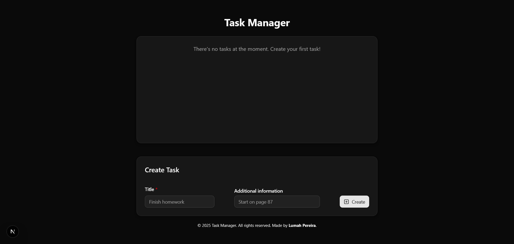

# Task Manager
[](#) [](#) [](#) [](#) [](#)

In need of organization? Then **Task Manager** is the perfect application for you. Organize your tasks and never feel lost again.

## Technologies
- **Frontend**: TypeScript, TailwindCSS;
  - React, Next.js, shadcn/ui.
- **Backend**: tRPC;
- **Database**: local storage.

## Screenshots


## Functionalities
Create, read, update and delete tasks.

## How to run locally
Step by step guide of how to run the project locally on your machine.

### Pre-requisites
- **Git**: install the latest version from the official website by clicking [here](https://git-scm.com/downloads);
- **Node.js**: install the latest version from the official website by clicking [here](https://nodejs.org/pt/download);

### Installing
Run the command
First, clone the repository.
```bash
git clone https://github.com/lumahloi/task-manager/
```

Install your dependencies.
```bash
npm install
```

### Running locally
Open a terminal and run the server.
```bash
npm run dev
```

## tRPC endpoints
Check all available endpoints clicking [here](./docs/endpoints.md).

## Author


***Lumah Pereira***


[](https://www.linkedin.com/in/lumah-pereira) [](https://www.github.com/lumahloi) [](https://www.lumah-pereira.vercel.app)